# BBDown 简易使用方法

BBDown是一个下载B站视频的命令行工具，本文档使用BBDown作为范例介绍命令行工具的一般使用方法。

本文档看起来比较长，但是顺利的话可以在10分钟内完成所有步骤，并从此一劳永逸。

---

## 准备

### 操作系统

+ 微软 Windows 10及以上

### 软件

在Windows 11系统以后，默认的终端为Windows Terminal，但Windows 10需要手动安装

+ BBDown
    + GitHub Release：https://github.com/nilaoda/BBDown/releases/download/1.5.4/BBDown_1.5.4_20221019_win-x64.zip

+ FFmpeg
    + GitHub Release: https://github.com/BtbN/FFmpeg-Builds/releases/download/latest/ffmpeg-master-latest-win64-gpl-shared.zip

+ Windows Terminal（可选）
    + Microsoft Store
    + GitHub Release：https://github.com/microsoft/terminal/releases/download/v1.15.3465.0/Microsoft.WindowsTerminal_Win10_1.15.3465.0_8wekyb3d8bbwe.msixbundle

### 环境

+ 安装完成Windows Terminal后，在桌面或文件资源管理器空白处右键，查看是否存在`在终端中打开`或`在Windows Terminal中打开`项，如果没有请重启系统。
    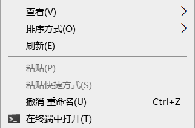
    
+ 创建一个长期使用、路径不存在中文与空格的文件夹，如`C:\CodeEnv`，里面专门存放脚本或可执行文件形式的命令
    + 将`BBDown.exe`移动到此文件夹中
    + 将FFmpeg解压后，将`bin`目录中所有文件都移动到此文件夹中

+ 将其添加到系统环境变量。（此步骤可选）
    + 打开高级系统设置
        + 在任务栏搜索框中输入`env`或`环境变量`
        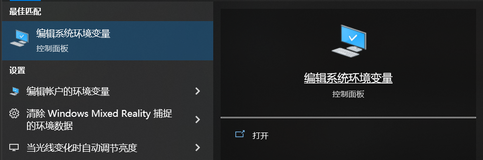
        + 在桌面中，选择`此电脑`，右键-属性，右侧选择高级系统设置
    + 选择环境变量
        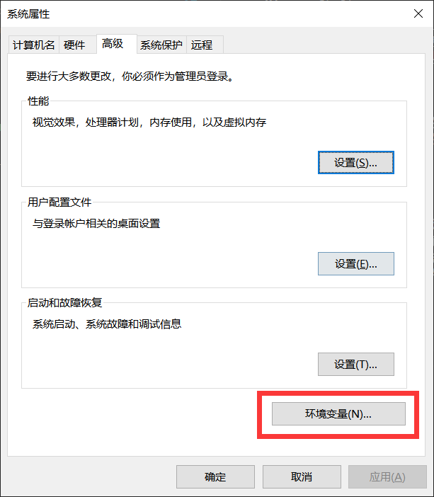
    + 选择用户变量中的`Path`，双击打开编辑窗口
        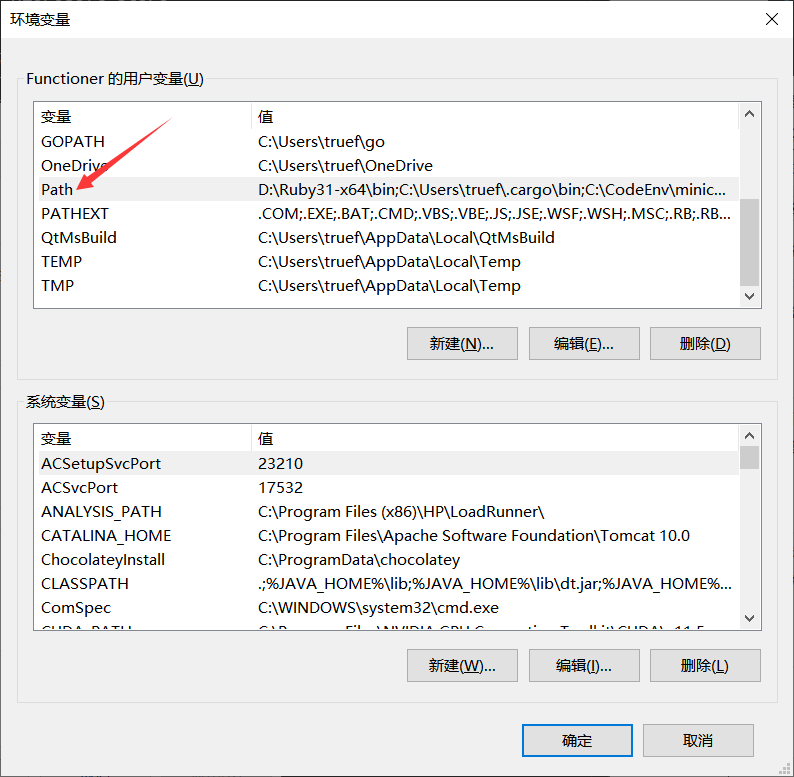
    + 点击右侧`新建`，在新的一项中填入这个文件夹的绝对路径
        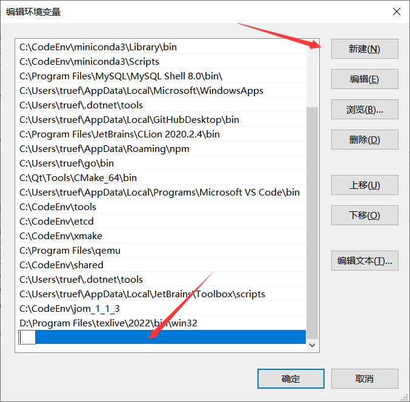

## 打开终端

### Windows Teriminal

+ 如果安装了Windows Terminal，那么可以通过在任意文件夹窗口空白处右键进入终端；

+ 如果进入终端后打开的是`Powershell`，更推荐使用命令提示符
    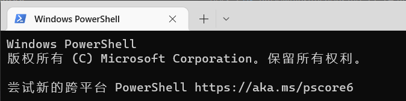
+ 此时可以点击标题栏的`+`打开命令提示符标签页，也可以打开设置面板将默认配置文件改为`命令提示符`并保存，然后重新打开Windows Terminal窗口
    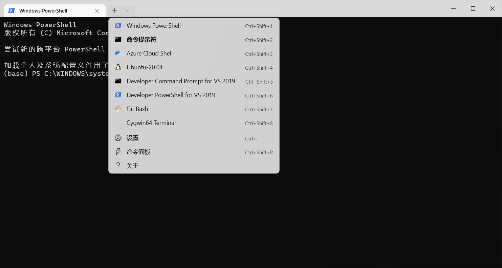
    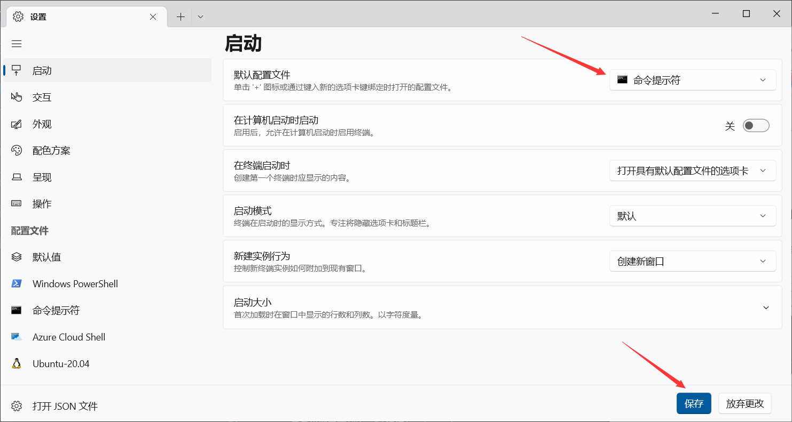

+ 确保进入的标签页是命令提示符即可
    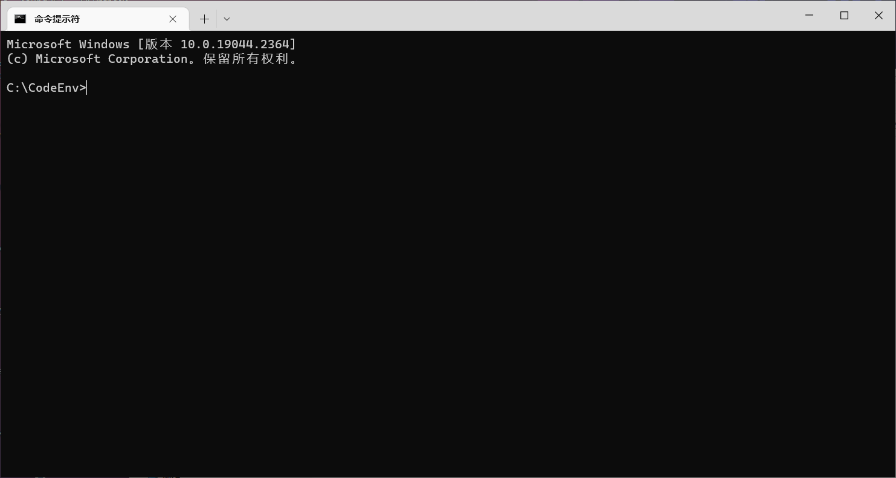

### cmd.exe

+ 如果没有安装Windows Terminal，只能通过本地`cmd.exe`使用终端，有以下两种方式；
    + 任务栏搜索或`Win+R`运行`cmd.exe`
        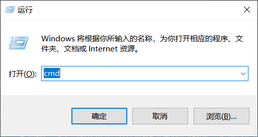
    + 在任意文件夹窗口的地址栏填入`cmd`，然后按回车
        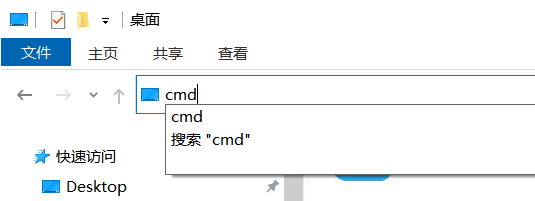

+ 终端窗口如下
    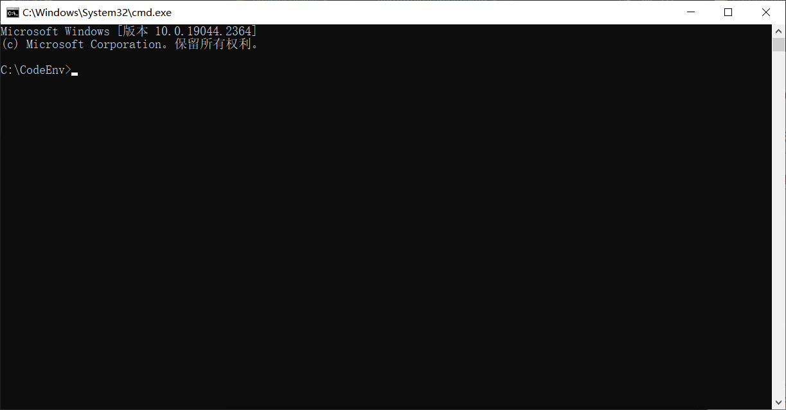

## 终端窗口介绍

### 运行命令

+ 输入一串字符串，每个字符串以空格为分隔符，再按回车，表示你要执行以第一个字符串为命令名称，后面的一系列字符串为参数列表的命令；

+ 一个命令要么是终端的内置命令，要么是一个操作系统可以直接执行的文件（在Windows上一般是exe或bat文件）；

+ 如输入`ping www.bilibili.com`，表示你要执行`ping`命令，并且只有一个参数，参数为`www.bilibili.com`;
    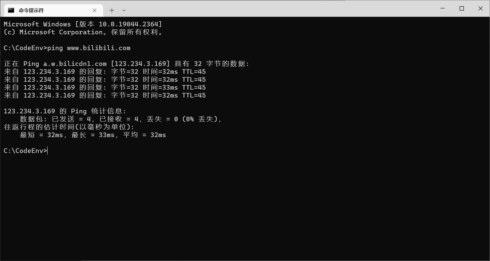

+ `ping`命令是使用ICMP协议检测网络是否连通的工具，一般操作系统都会支持这个命令。如果你执行`ping www.youtube.com`那肯定是会失败的。程序员说的`ping通`或者`ping不通`就是指这个命令；

+ 运行一行命令，必须有命令名称，可以没有参数，也可以有一个或多个参数，具体需要什么参数由命令本身决定，如`ping`命令就需要一个参数（域名或ip地址）；

+ 如果执行命令时参数格式不正确，那么命令将无法成功执行，比较良心的开发者会在你输错命令时弹出使用方法，比如你使用`ping`命令但不给参数直接运行，那么就会输出帮助列表；
    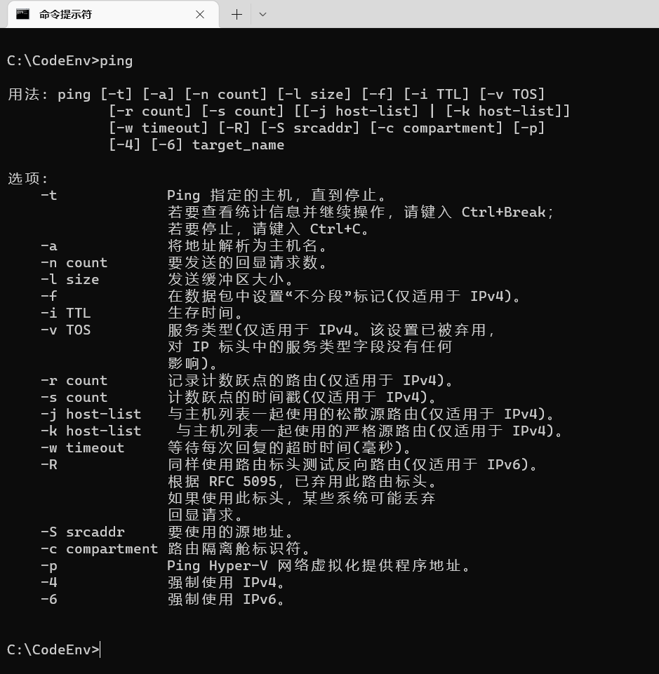

### 当前路径

+ `>`左侧为当前路径，表示此时此刻，如果你运行一个命令，那么操作系统会首先在这个路径找这个命令。
    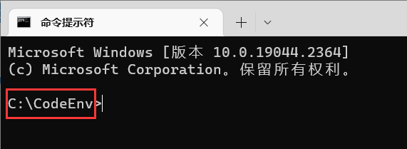

+ 举个例子，如果你输入`ping www.bilibili.com`并按下回车，那么操作系统就会开始找`ping.exe`或`ping.bat`。如果在当前路径找到这个文件，那么就直接执行；如果找不到，那么操作系统还会去环境变量`Path`对应的那个路径列表挨个找过去。

+ 系统路径`C:\Windows\System32`是肯定在`Path`中的，而这个路径下存在`ping.exe`（Windows安装时就会带上，可以翻文件资源管理器），那么就会执行这个它。如果你动用管理员权限把`ping.exe`删掉了，那么之后再执行`ping`就会找不到命令。

+ 执行这个命令时，对应的`exe`的工作目录就是当前路径。

### cd 命令

+ 通过`cd /D XXX`可以切换当前目录；
    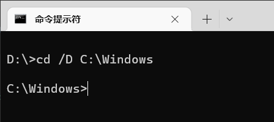

+ 如果命令的`exe`所在文件夹在`Path`中，那么不管当前路径是什么都可以成功执行这个命令，否则，你就需要将当前路径切换为`exe`所在的路径，然后执行。

+ 所有`exe`文件都是命令，文件资源管理中双击运行一个`exe`相当于终端中不带参数执行这个命令；

## 下载B站视频

+ 讲了这么多相信你也累了，那么来实践一下。

+ 在你放置`BBDown.exe`的路径打开终端，有以下三种方式。
    + 进入文件夹，空白处双击，在终端中打开
    + 进入文件夹，地址栏输入`cmd`，回车
    + 使用`Win+R`运行`cmd.exe`，然后使用`cd /D`切换到`BBDown.exe`所在目录。

+ 所以为什么让你使用Windows Terminal，因为你在哪儿右键打开当前目录就是哪儿，不需要`cd`切换，所以最方便。

### 显示版本号

```sh
BBDown --version
```

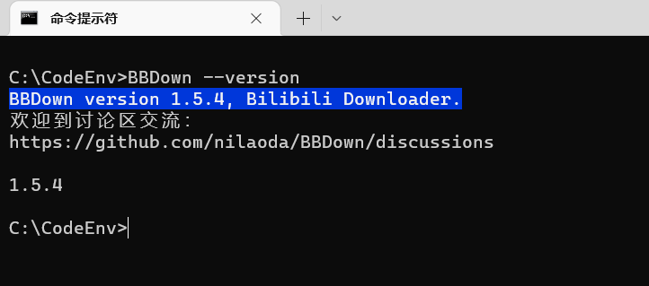

### 登录

```sh
BBDown login
```
+ 之后会弹出二维码，如果尺寸太大可使用`Ctrl+滚轮`缩放，扫码登录，登陆成功后，`BBDown.exe`所在目录会出现一个`BBDown.data`保存cookie信息，以后就不用登录了。

+ 登录是为了下载高清视频。

### 下载一个B站视频


以`【派大星的独白】一个关于正常人的故事`为例，我们下载这个视频。
```sh
BBDown BV1qt411j7fV
```
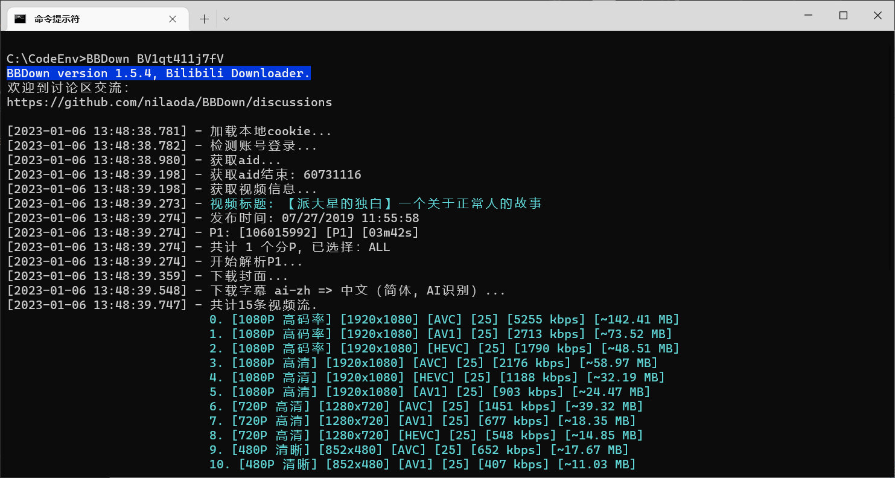
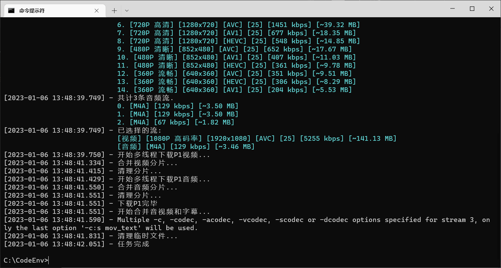

+ 当前路径会出现下载完成的mp4文件，下载完毕。

### 查看帮助

```sh
BBDown --help
````

+ 显示帮助
```sh
C:\CodeEnv>BBDown --help
BBDown version 1.5.4, Bilibili Downloader.
欢迎到讨论区交流：
https://github.com/nilaoda/BBDown/discussions

Description:
  BBDown是一个免费且便捷高效的哔哩哔哩下载/解析软件.

Usage:
  BBDown <url> [command] [options]

Arguments:
  <url>  视频地址 或 av|bv|BV|ep|ss

Options:
  ...
  -ia, --interactive  交互式选择清晰度
  ...


Commands:
  login    通过APP扫描二维码以登录您的WEB账号
  logintv  通过APP扫描二维码以登录您的TV账号
```

+ 发现`-ia`参数可以选择清晰度。

### 选择清晰度


+ 找一个支持4K的视频，这里挑选了影视飓风的。

```sh
BBDown BV16Z4y1H7NG -ia
```

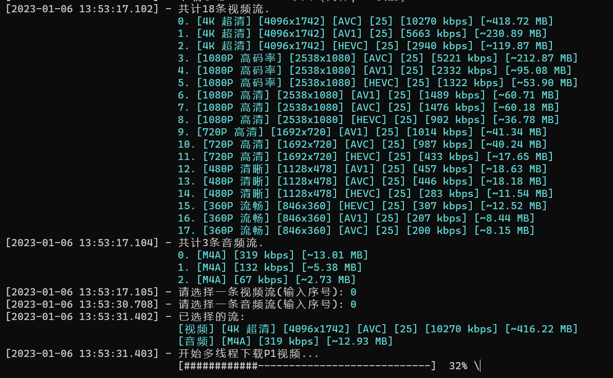

+ 由于是交互式选择，所以需要手动输入你要选择的视频流与音频流的序号（数字），我都选择了第0条；
+ 由于是4K视频，所以下载下来的视频文件相当大。

## 音视频处理

B站提供的视频是视频流与音频流分开的，BBDown下载后需要将视频流与音频流合并成一个视频，因此需要给混流。FFmpeg是业界通用的音视频处理解决方案，BBDown对其有依赖，因此我们需要将FFmpeg的一堆文件与之放在一起。

那么我们再来实践一下FFmpeg这个强大的工具。这里只讲几个简单的操作，具体可以参考`BV1AT411J7cH`这个视频。


### 查看媒体信息

```sh
ffprobe "相 机 大 战.mp4"
```
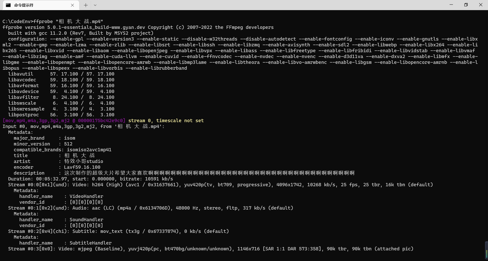

### 提取音频

```sh
ffmpeg -i "相 机 大 战.mp4" 1.mp3
```

+ 会发现同目录下出现一个`1.mp3`，包含的是该视频的音频流。

### 转格式

```sh
ffmpeg -i 1.mp3 1.wav
```

+ 会将刚才提取的`1.mp3`转为`1.wav`。当然，转视频格式也是可以的，可以用同样的语法将刚才的视频转为其他视频格式，但是4K视频太大所以较慢。

## 其他

### 为什么要配置环境变量

+ 将`BBDown`与`FFmpeg`所在的路径添加到系统`Path`中，这样以后不管在什么文件夹下打开终端，不管你`cd`切换到什么目录，都能直接运行这两个命令；否则，你就必须每次都在它俩所在的文件夹去打开终端，或者`cd`到这个目录。

+ 有关环境变量请参考这个视频`BV1w741147G9`。

### 工作目录与exe所在目录的区别

+ 在终端中执行的任何命令，其工作目录就是终端的当前目录；

+ 你如果将一个文件的路径作为参数提供给命令，那么这个路径应该是相对于工作目录的相对路径，或者绝对路径；

+ `BBDown.data`存储在`BBDown.exe`的所在目录，而下载下来的视频保存在工作目录，这是有讲究的。可执行文件所在目录，一般相当于全局位置，而工作目录相当于临时位置。你的登录信息当然不希望每个地方都存一份，而你下载视频保存的路径可能每次都不一样。